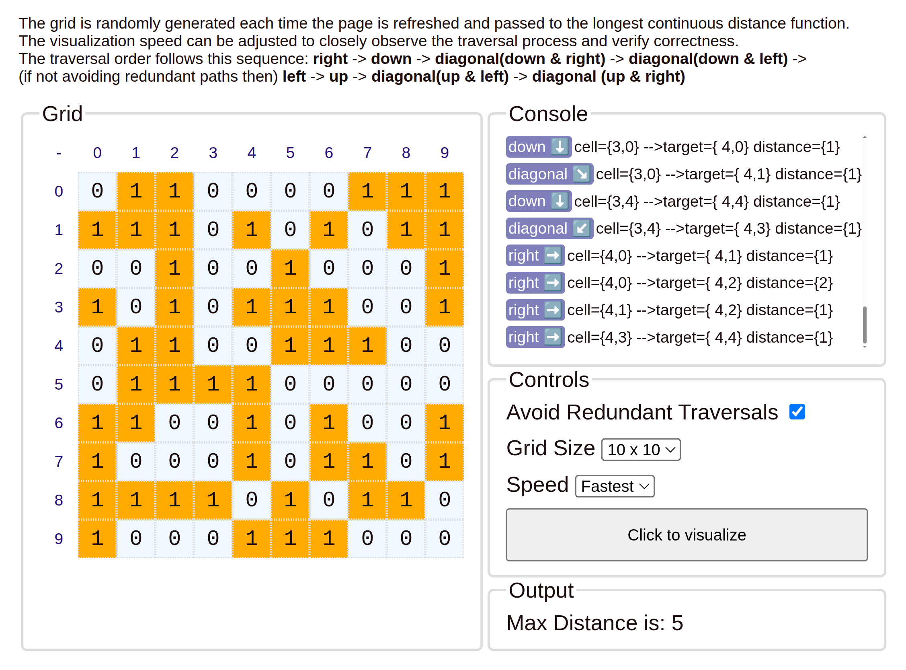

## Finding the Longest Continuous Distance from a Pixel in a Grid

Over the weekend, I revisited the problem we discussed on Friday and worked out a more complete solution. Since I no longer had access to the original link, I reconstructed the problem from memory and added a few improvements:

- **Movement directions**: Defined a container holding all possible moves (up, down, left, right, and diagonals if applicable) from any pixel.
- **Bounds checking**: Ensured each computed pixel position is valid before attempting access.
- **Iteration over steps**: Iterated through possible durations/steps in a given direction.
- **Directional traversal**: Continued iterating in a chosen direction until no further "on" pixels were found.

### C++ Implementation  

To build and execute the C++ version on Linux, ensure `g++` is installed, then run:

```bash
g++ -o main longest-continuous-pixel.cc && ./main
```  

### JavaScript Implementation with Visualization  

A JavaScript version is also provided with a simple visualization. To run it:  

1. Open the included [index.html](index.html) file in any modern browser.  
2. Refresh the page to regenerate a new grid and re-run the visualization.  



[Screencast-5.webm](https://github.com/user-attachments/assets/cc24fc39-47f3-48e2-9d40-932f93082c91)